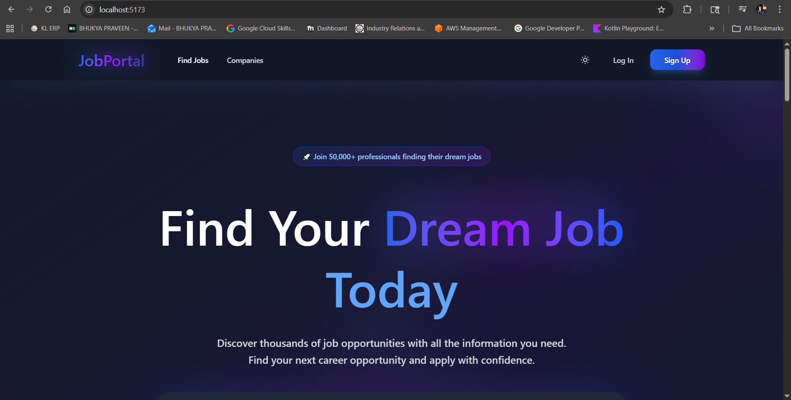
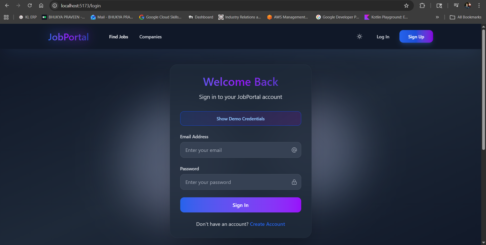
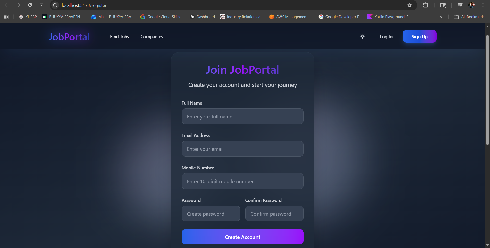
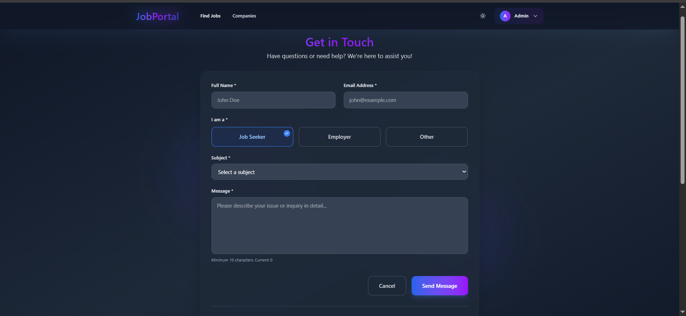
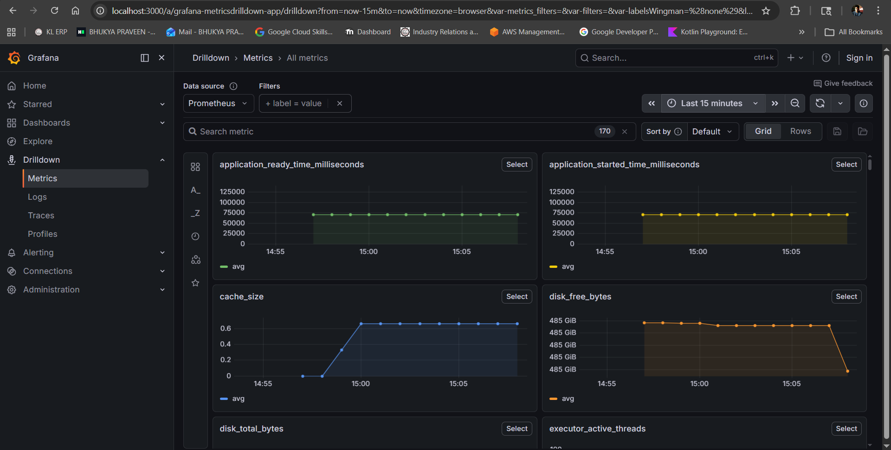

# 🚀 JobPortal — Full Stack Job Portal Platform

<div align="center">


</div>

---

# 🌟 Overview

JobPortal is a modern enterprise-grade Full Stack Job Portal platform designed for:

- 👨‍💼 Job Seekers
- 🏢 Employers
- 🛡️ Administrators

The platform provides secure authentication, job management, application tracking, profile management, company management, monitoring, and a responsive modern UI.

---

# 📸 Application Screenshots

## 🏠 Home Page

<p align="center">
  
</p>

---

## 🔐 Login Page

<p align="center">
  
</p>

---

## 📝 Register Page

<p align="center">
  
</p>

---

## 📝 Contact Page

<p align="center">
  
</p>

---

## 📝 Grafana Page

<p align="center">
  
</p>

---

# ✨ Features

## 🔐 Authentication & Security

- JWT-Based Authentication
- Spring Security Integration
- Role-Based Authorization
- BCrypt Password Encryption
- CSRF Protection
- CORS Configuration
- Protected Frontend Routes
- Secure REST APIs

---

## 👨‍💻 Job Seeker Features

- Search Jobs
- Filter Jobs
- Apply for Jobs
- Save Jobs
- Upload Resume
- Manage Profile
- Track Applications
- View Application Status

---

## 🏢 Employer Features

- Create Job Listings
- Manage Posted Jobs
- Update Job Status
- Review Applicants
- Company Profile Management
- Application Pipeline Tracking

---

## 🛡️ Admin Features

- User Management
- Company Management
- Employer Management
- Contact Management
- Dashboard Analytics
- Platform Monitoring

---

## 🎨 Frontend Features

- Responsive Design
- Dark & Light Mode
- Toast Notifications
- Protected Routes
- Form Validation
- Context API State Management
- Axios API Integration
- Modern UI Components

---

# 🏗️ Technology Stack

## ☕ Backend Technologies

| Technology | Usage |
|------------|-------|
| ☕ Java 25 | Core Programming Language |
| 🌱 Spring Boot 4 | Backend Framework |
| 🔒 Spring Security | Authentication & Authorization |
| 🎫 JWT | Secure Token Authentication |
| 🗄️ Spring Data JPA | ORM Framework |
| 🐬 MySQL | Relational Database |
| 🧩 Hibernate | JPA Implementation |
| ⚡ Caffeine Cache | Performance Optimization |
| 📘 Swagger/OpenAPI | API Documentation |
| 📊 OpenTelemetry | Monitoring & Tracing |
| 📝 Logback | Logging Framework |
| 🧰 Maven | Dependency Management |
| 🐳 Docker | Containerization |
| 🧪 H2 Database | Testing Database |
| 🧬 Lombok | Boilerplate Reduction |

---

## ⚛️ Frontend Technologies

| Technology | Usage |
|------------|-------|
| ⚛️ React 19 | Frontend Library |
| ⚡ Vite 7 | Build Tool |
| 🎨 Tailwind CSS 4 | Styling Framework |
| 🔀 React Router DOM | Client-Side Routing |
| 🌐 Axios | HTTP Client |
| 🔔 React Toastify | Notifications |
| 🗂️ Redux Toolkit | State Management |
| 🎯 Context API | Global State |
| 🎭 Font Awesome | Icons |
| ✨ Lucide React | Modern Icons |
| 🍪 js-cookie | Cookie Management |
| 💳 Stripe Integration | Payment Support |
| 🧹 ESLint | Code Quality |

---

# 🏛️ System Architecture

```text
Client (React UI)
        ↓
REST API Layer
        ↓
Spring Boot Backend
        ↓
Controller Layer
        ↓
Service Layer
        ↓
Repository Layer
        ↓
MySQL Database
```

---

# 📂 Backend Package Structure

```text
com.portal.jobportal
│
├── aspects
├── auth
├── cache
├── client
├── company
├── config
├── constants
├── contact
├── dto
├── entity
├── exception
├── job
├── otel
├── repository
├── security
├── user
└── util
```

---

# 📁 Frontend Project Structure

```text
job-portal-ui/
│
├── public/
├── src/
│   ├── components/
│   ├── pages/
│   ├── context/
│   ├── services/
│   ├── config/
│   ├── data/
│   ├── App.jsx
│   └── main.jsx
│
├── package.json
├── vite.config.js
└── eslint.config.js
```

---

# 🗃️ Database Design

| Table Name | Description |
|------------|-------------|
| users | User Accounts |
| roles | User Roles |
| companies | Company Information |
| jobs | Job Listings |
| profiles | User Profiles |
| job_applications | Job Applications |
| saved_jobs | Saved Jobs |
| contacts | Contact Messages |

---

# 🔄 Entity Relationships

```text
Company      1 ─────── * Jobs

Role         1 ─────── * Users

User         1 ─────── 1 Profile

User         * ─────── * Saved Jobs

User         1 ─────── * Job Applications
```

---

# 🔐 Authentication Flow

```text
User Login
    ↓
JWT Token Generated
    ↓
Authorization Header
    ↓
JWT Validation Filter
    ↓
Protected API Access
```

---

# 📡 API Modules

## 🔑 Authentication APIs

```http
POST /auth/login/public
POST /auth/register/public
```

---

## 🏢 Company APIs

```http
GET    /companies/public
POST   /companies/admin
GET    /companies/admin
PUT    /companies/{id}/admin
DELETE /companies/{id}/admin
```

---

## 💼 Job APIs

```http
POST   /jobs/employer
GET    /jobs/employer
PATCH  /jobs/{jobId}/status/employer
GET    /jobs/applications/{jobId}/employer
PATCH  /jobs/applications/employer
```

---

## 👤 User APIs

```http
GET    /users/search/admin

PATCH  /users/{userId}/role/employer/admin

PATCH  /users/{userId}/company/{companyId}/admin

PUT    /users/profile/jobseeker

GET    /users/profile/jobseeker

POST   /users/saved-jobs/{jobId}/jobseeker

DELETE /users/saved-jobs/{jobId}/jobseeker

GET    /users/saved-jobs/jobseeker

POST   /users/job-applications/jobseeker

DELETE /users/job-applications/{jobId}/jobseeker

GET    /users/job-applications/jobseeker
```

---

# ⚡ Caching Strategy

| Cache | TTL | Max Size |
|-------|-----|-----------|
| Jobs Cache | 10 Minutes | 5000 |
| Companies Cache | 10 Minutes | 500 |
| Roles Cache | 1 Day | 100 |

---

# 📊 Monitoring & Observability

- 📈 Spring Boot Actuator
- 🔍 OpenTelemetry
- 📝 Logback Logging
- ⚡ Performance Metrics
- 📊 Application Monitoring

---

# 🌍 Application Profiles

| Profile | Purpose |
|---------|----------|
| default | Development |
| qa | Testing |
| prod | Production |

---

# ⚙️ Backend Setup

## 📋 Prerequisites

- Java 25
- Maven 3.6+
- MySQL 8+
- Node.js 16+
- npm or yarn

---

# 🗄️ Database Setup

Run SQL scripts from:

```text
src/main/resources/sql/
```

Required SQL files:

```text
jobportal-schema.sql
jobportal-data.sql
```

---

# ▶️ Run Backend

```bash
mvn spring-boot:run
```

---

# ▶️ Run Frontend

```bash
npm install

npm run dev
```

---

# 🔐 Environment Variables

## Backend Variables

```env
DATABASE_HOST=localhost
DATABASE_PORT=3308
DATABASE_NAME=jobportal
DATABASE_USERNAME=root
DATABASE_PASSWORD=root
JWT_SECRET=jxgEQeXHuPq8VdbyYFNkANdudQ53YUn4
LOG_LEVEL=INFO
```

---

## Frontend Variables

```env
VITE_API_BASE_URL=http://localhost:8080/api
VITE_ENABLE_PAYMENTS=false
```

---

# 📘 API Documentation

## Swagger UI

```text
http://localhost:8080/swagger-ui.html
```

---

# 🐳 Docker Support

## Build Backend

```bash
mvn clean package
```

---

## Run JAR

```bash
java -jar target/jobportal-aws-deployement.jar
```

---

# 🚀 Future Enhancements

- AI Resume Screening
- Real-Time Messaging
- Video Interviews
- AWS Deployment
- Elasticsearch Integration
- Mobile Application

---

# 👨‍💻 Developer

## Bhukya Praveen

🎓 B.Tech — Computer Science & Engineering  
☁️ Cloud & Edge Computing  
☕ Java Full Stack Developer  

---

# ⭐ Project Highlights

- Enterprise-Level Architecture
- Full Stack Development
- JWT Authentication
- RESTful APIs
- Modern React Frontend
- Docker Support
- Monitoring & Observability
- Production-Ready Design

---

# 📜 License

This project is licensed under the MIT License.

---

# 🌟 Support

If you like this project:

- ⭐ Star the repository
- 🍴 Fork the repository
- 📢 Share with developers

---

<div align="center">

Built with ❤️ using Java, Spring Boot, React, and MySQL.

</div>
